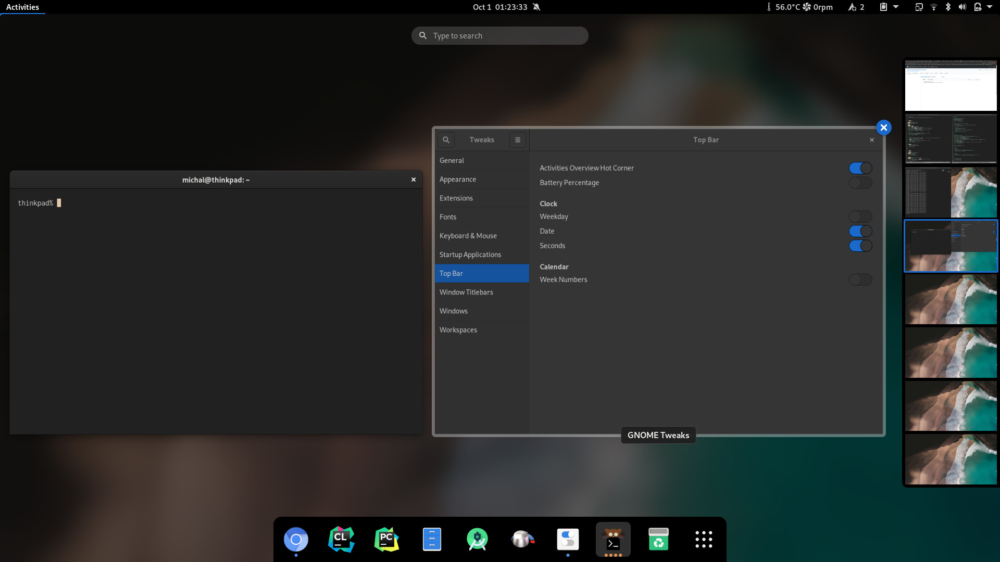
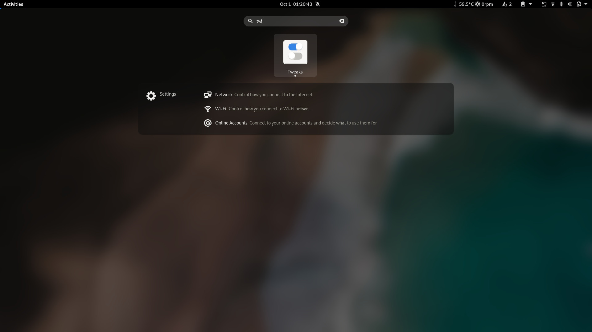

# Adwaita Dark Elegance
The darker version of default Gnome Shell theme

This theme is based on [this repository](https://github.com/ryanlerch/gnome-shell-theme-base).

This theme tweaks some gray elements of the base theme, removes borders etc.  
Creating an universal theme is very hard so it cannot always fit every environment,  
that is the reason I made this tweaked version suitable for non completely black wallpapers.


Best with Blyr extension.  

## Build & Install
ensure you have some ```sass``` implementation installed.  
Then build:  
```./generate_theme.sh```  
Optionally install (locally):  
```./install_local.sh```  
and switch theme using Gnome Tweaks


## Previews


